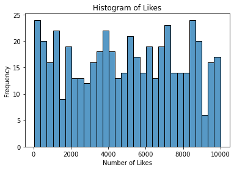
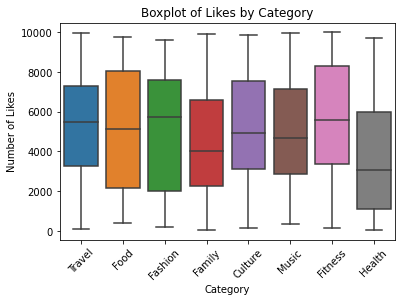

# Clean & Analyze Social Media

## Introduction

Social media has become a ubiquitous part of modern life, with platforms such as Instagram, Twitter, and Facebook serving as essential communication channels. Social media data sets are vast and complex, making analysis a challenging task for businesses and researchers alike. In this project, we explore a simulated social media, for example Tweets, data set to understand trends in likes across different categories.

## Prerequisites

To follow along with this project, you should have a basic understanding of Python programming and data analysis concepts. In addition, you may want to use the following packages in your Python environment:

- pandas
- Matplotlib
- ...

These packages should already be installed in Coursera's Jupyter Notebook environment, however if you'd like to install additional packages that are not included in this environment or are working off platform you can install additional packages using `!pip install packagename` within a notebook cell such as:

- `!pip install pandas`
- `!pip install matplotlib`

## Project Scope

The objective of this project is to analyze tweets (or other social media data) and gain insights into user engagement. We will explore the data set using visualization techniques to understand the distribution of likes across different categories. Finally, we will analyze the data to draw conclusions about the most popular categories and the overall engagement on the platform.

## Step 1: Importing Required Libraries

As the name suggests, the first step is to import all the necessary libraries that will be used in the project. In this case, we need pandas, numpy, matplotlib, seaborn, and random libraries.

Pandas is a library used for data manipulation and analysis. Numpy is a library used for numerical computations. Matplotlib is a library used for data visualization. Seaborn is a library used for statistical data visualization. Random is a library used to generate random numbers.


```python
import pandas as pd
import numpy as np
import matplotlib.pyplot as ma
import seaborn as sb
import random as ra
```

# Step 2 Generate Data


```python
categories = ["Travel", "Fashion", "Fitness", "Family", "Health"]
print(ra.choice(categories))
```


```python

categories = ['Food', 'Travel', 'Fashion', 'Fitness', 'Music', 'Culture', 'Family', 'Health']


n = 500


data = {
    'Date': pd.date_range('2021-01-01', periods=n),  # Generate 500 dates starting from 2021-01-01
    'Category': [ra.choice(categories) for _ in range(n)],  # Random choice from the list of categories
    'Likes': np.random.randint(0, 10000, size=n)  # Random integer for likes between 0 and 10000
}


df = pd.DataFrame(data)


df.head()
```


<div>
<style scoped>
    .dataframe tbody tr th:only-of-type {
        vertical-align: middle;
    }

    .dataframe tbody tr th {
        vertical-align: top;
    }

    .dataframe thead th {
        text-align: right;
    }
</style>
<table border="1" class="dataframe">
  <thead>
    <tr style="text-align: right;">
      <th></th>
      <th>Date</th>
      <th>Category</th>
      <th>Likes</th>
    </tr>
  </thead>
  <tbody>
    <tr>
      <th>0</th>
      <td>2021-01-01</td>
      <td>Travel</td>
      <td>3900</td>
    </tr>
    <tr>
      <th>1</th>
      <td>2021-01-02</td>
      <td>Food</td>
      <td>4839</td>
    </tr>
    <tr>
      <th>2</th>
      <td>2021-01-03</td>
      <td>Fashion</td>
      <td>8660</td>
    </tr>
    <tr>
      <th>3</th>
      <td>2021-01-04</td>
      <td>Travel</td>
      <td>3739</td>
    </tr>
    <tr>
      <th>4</th>
      <td>2021-01-05</td>
      <td>Family</td>
      <td>5109</td>
    </tr>
  </tbody>
</table>
</div>


# Step 3 Load Data 


```python
print(df)
```

              Date Category  Likes
    0   2021-01-01   Travel   3900
    1   2021-01-02     Food   4839
    2   2021-01-03  Fashion   8660
    3   2021-01-04   Travel   3739
    4   2021-01-05   Family   5109
    ..         ...      ...    ...
    495 2022-05-11   Travel    158
    496 2022-05-12    Music   5211
    497 2022-05-13    Music   7130
    498 2022-05-14   Family   8740
    499 2022-05-15   Health   3578
    
    [500 rows x 3 columns]


# Step 4 Clean the data


```python

df_cleaned = df.dropna()

df_cleaned = df_cleaned.drop_duplicates()

df_cleaned['Date'] = pd.to_datetime(df_cleaned['Date'])

df_cleaned['Likes'] = df_cleaned['Likes'].astype(int)

df_cleaned.head()

```


<div>
<style scoped>
    .dataframe tbody tr th:only-of-type {
        vertical-align: middle;
    }

    .dataframe tbody tr th {
        vertical-align: top;
    }

    .dataframe thead th {
        text-align: right;
    }
</style>
<table border="1" class="dataframe">
  <thead>
    <tr style="text-align: right;">
      <th></th>
      <th>Date</th>
      <th>Category</th>
      <th>Likes</th>
    </tr>
  </thead>
  <tbody>
    <tr>
      <th>0</th>
      <td>2021-01-01</td>
      <td>Travel</td>
      <td>3900</td>
    </tr>
    <tr>
      <th>1</th>
      <td>2021-01-02</td>
      <td>Food</td>
      <td>4839</td>
    </tr>
    <tr>
      <th>2</th>
      <td>2021-01-03</td>
      <td>Fashion</td>
      <td>8660</td>
    </tr>
    <tr>
      <th>3</th>
      <td>2021-01-04</td>
      <td>Travel</td>
      <td>3739</td>
    </tr>
    <tr>
      <th>4</th>
      <td>2021-01-05</td>
      <td>Family</td>
      <td>5109</td>
    </tr>
  </tbody>
</table>
</div>


```python
df_cleaned.tail()
```


<div>
<style scoped>
    .dataframe tbody tr th:only-of-type {
        vertical-align: middle;
    }

    .dataframe tbody tr th {
        vertical-align: top;
    }

    .dataframe thead th {
        text-align: right;
    }
</style>
<table border="1" class="dataframe">
  <thead>
    <tr style="text-align: right;">
      <th></th>
      <th>Date</th>
      <th>Category</th>
      <th>Likes</th>
    </tr>
  </thead>
  <tbody>
    <tr>
      <th>495</th>
      <td>2022-05-11</td>
      <td>Travel</td>
      <td>158</td>
    </tr>
    <tr>
      <th>496</th>
      <td>2022-05-12</td>
      <td>Music</td>
      <td>5211</td>
    </tr>
    <tr>
      <th>497</th>
      <td>2022-05-13</td>
      <td>Music</td>
      <td>7130</td>
    </tr>
    <tr>
      <th>498</th>
      <td>2022-05-14</td>
      <td>Family</td>
      <td>8740</td>
    </tr>
    <tr>
      <th>499</th>
      <td>2022-05-15</td>
      <td>Health</td>
      <td>3578</td>
    </tr>
  </tbody>
</table>
</div>


# Step 5 Visualize Data

First, visualize the data using the seaborn module in a histogram plot of the Likes.  This is accomplished using the method histplot, passing in the dataframe field ‘Likes’ as in df[‘Likes’]. 


```python
sb.histplot(df_cleaned['Likes'], bins=30, kde=False)
ma.title('Histogram of Likes')
ma.xlabel('Number of Likes')
ma.ylabel('Frequency')
ma.show()
```





Create a boxplot with the x axis as ‘Category’, and the y axis as ‘Likes’. 


```python
sb.boxplot(x='Category', y='Likes', data=df_cleaned)
ma.title('Boxplot of Likes by Category')
ma.xlabel('Category')
ma.ylabel('Number of Likes')
ma.xticks(rotation=45)
ma.show()
```





 print out the mean of the ‘Likes’ catregory.


```python
mean_likes = df_cleaned['Likes'].mean()
print(f"Mean of Likes: {mean_likes}")
```

    Mean of Likes: 4930.94


use the dataframe’s groupby method to print out the mean of each Category ‘Likes’


```python
mean_likes_by_category = df_cleaned.groupby('Category')['Likes'].mean()
print("Mean Likes by Category:")
print(mean_likes_by_category)
```

    Mean Likes by Category:
    Category
    Culture    5003.619048
    Family     4451.500000
    Fashion    5102.338462
    Fitness    5592.820513
    Food       5235.735849
    Health     3617.923077
    Music      5012.982143
    Travel     5171.950820
    Name: Likes, dtype: float64


```python

```
